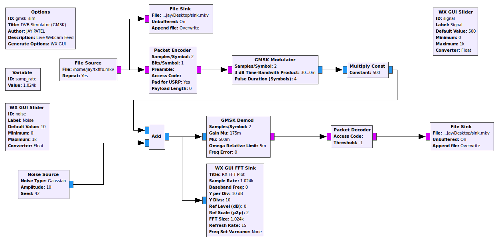
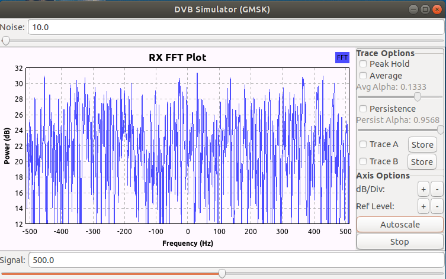
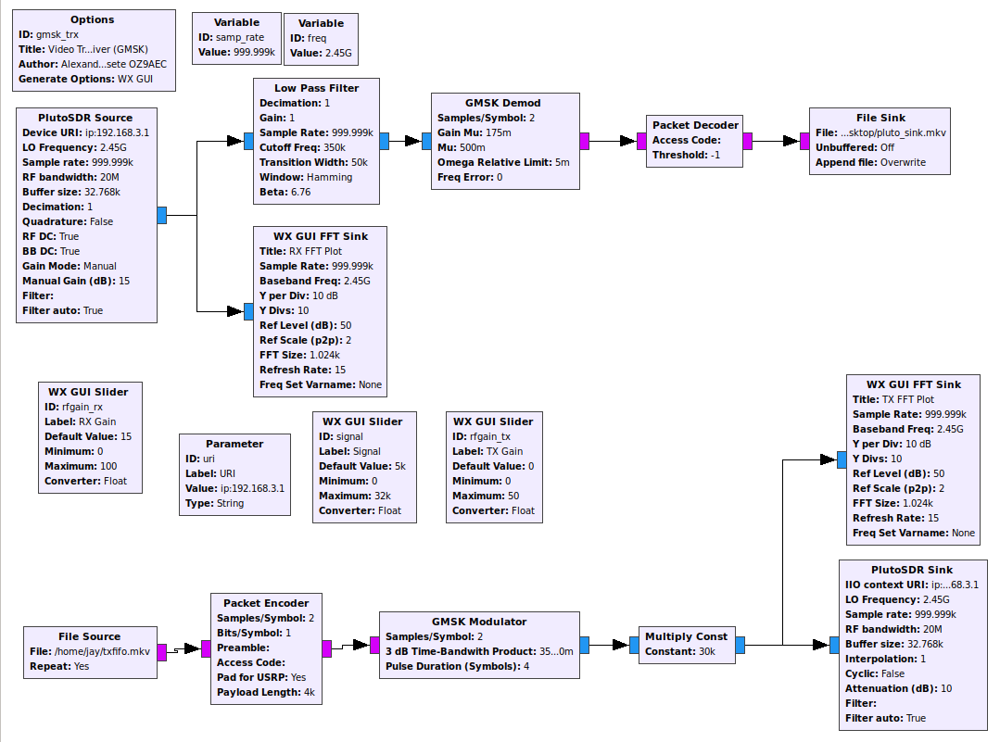

# Live feed with gstreamer and GNU-Radio
Live feed with usb-webcam, gstreamer-1.0 and GNU Radio using GMSK

- Here is what you need for simulation :
```bash
1. Linux based machine with GNURadio,
2. gstreamer-1.0,
3. v4l2-util
```
- This can also be used any SDR with slide modifications.

## Step 1: Create a pipeline using mkfifo
```bash
mkfifo txfifo.mkv 
```

## Step 2: Stream usb-webcam feed to that pipeline. 

```bash
gst-launch-1.0 -e autovideosrc ! video/x-raw,width=640,height=360,framerate=30/1 ! queue ! videoconvert ! mkv. matroskamux name=mkv ! filesink location=txfifo.mkv sync=false
```

you have to adapt settings for your usb webcam. Here is some of the useful gstream commands that can help you to see more details about your webcam.
```bash
sudo apt-get install v4l-utils                              % install v4l-utils on Debian-based distros

v4l2-ctl -d /dev/video0 --list-formats-ext                  % to see video source details, in my case video0 is my webcam
```
You can see the following output, in my case i have 
```bash
jay@jay-MS-7885:~/leansdr/src/apps$ v4l2-ctl -d /dev/video0 --list-formats-ext 
ioctl: VIDIOC_ENUM_FMT
	Index       : 0
	Type        : Video Capture
	Pixel Format: 'YUYV'
	Name        : YUYV 4:2:2
		Size: Discrete 640x480
			Interval: Discrete 0.033s (30.000 fps)
			Interval: Discrete 0.042s (24.000 fps)
			Interval: Discrete 0.050s (20.000 fps)
			Interval: Discrete 0.067s (15.000 fps)
			Interval: Discrete 0.100s (10.000 fps)
			Interval: Discrete 0.133s (7.500 fps)
			Interval: Discrete 0.200s (5.000 fps)
	Index       : 1
	Type        : Video Capture
	Pixel Format: 'MJPG' (compressed)
	Name        : Motion-JPEG
		Size: Discrete 640x480
			Interval: Discrete 0.033s (30.000 fps)
			Interval: Discrete 0.042s (24.000 fps)
			Interval: Discrete 0.050s (20.000 fps)
			Interval: Discrete 0.067s (15.000 fps)
			Interval: Discrete 0.100s (10.000 fps)
			Interval: Discrete 0.133s (7.500 fps)
			Interval: Discrete 0.200s (5.000 fps)
```
This might work for you, not sure this is totally based on your webcam,

```bash
----------------------------------------
gst-launch-1.0 -e autovideosrc ! video/x-raw-yuv,width=640,height=360,framerate=30/1 ! queue ! videoconvert ! mkv. matroskamux name=mkv ! filesink location=txfifo.mkv sync=false 
----------------------------------------
gst-launch-1.0 -e autovideosrc ! video/x-raw,width=640,height=360,framerate=30/1 ! queue ! videoconvert ! mkv. matroskamux name=mkv ! xvimagesink videotestsrc ! video/x-raw-yuv, framerate=30/1, width=640, height=360 ! filesink location=txfifo.mkv sync=false ! mix. 
----------------------------------------
```

## Step 3: Provide that stream to GNU Radio. You can use below Flow Graph(GMSK_SIM.GRC).

 

- Run the gmsk_sim.grc, you can see this python GUI for Rx,

 
 
 You have to change file source and sink path according to you. You can see your video on your desktop.
 
 ## Optional : You can also use GMSK_TRX file with little modification for ADALM Pluto.
 
  
 
Enjoy RFing !

## References
1. https://github.com/LamaBleu/Pluto-DATV-test
2. http://wiki.oz9aec.net/index.php/Simple_DVB_with_Gstreamer_and_GNU_Radio
3. https://github.com/csete/gnuradio-dvb
4. http://oz9aec.net/radios/gnu-radio/simple-dvb-with-gstreamer-and-gnu-radio
5. http://wiki.oz9aec.net/index.php/Gstreamer_cheat_sheet
